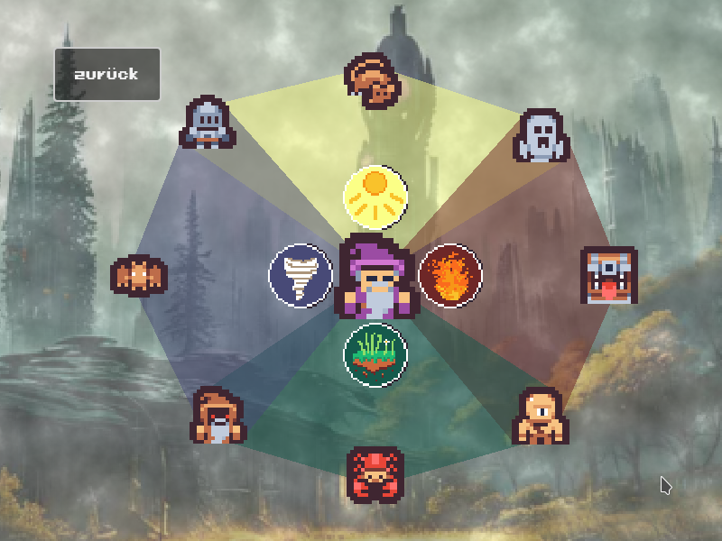

# Roundtrip

You're a wizard and you need to get down to the dungeon in an endless cycle down the staircase.
Fight your way through different monsters each vulnerable to specific elements.
Luckily as a wizard you know some spells combining different elements to defeat the monsters.

This game was made during the [Hetzner Game Jam 2023](https://github.com/hetzneronline/game-jam) in 48 hours.

It is licensed under GNU Affero General Public License version 3 or later.

Thanks to [Hetzner](https://hetzner.com) for providing the jam site.

▶ Play it online on [https://project-roundtrip.github.io/roundtrip/](https://project-roundtrip.github.io/roundtrip/)

## Downloads
* [Linux](https://project-roundtrip.github.io/roundtrip/roundtrip.x86_64)
* [Windows](https://project-roundtrip.github.io/roundtrip/roundtrip.exe)

## Credits

- [Godot Engine](https://docs.godotengine.org/en/stable/index.html)
- [Tiny Dungeon Sprites from Kenney](https://www.kenney.nl/assets/tiny-dungeon)
- [Pixeloid Font from FontSpace](https://www.fontspace.com/pixeloid-font-f69232)
- [Hit n Smash from FreePD](https://freepd.com)
- [Mysterious Lights from FreePD](https://freepd.com)
- [Blood Effects from XYEzawr](https://xyezawr.itch.io/gif-free-pixel-effects-pack-5-blood-effects)
- [090035_Splat!.wav from Pixabay](https://pixabay.com/sound-effects/090035-splatwav-91604/)
- [Click Button from Pixabay](https://pixabay.com/sound-effects/click-button-140881/)
